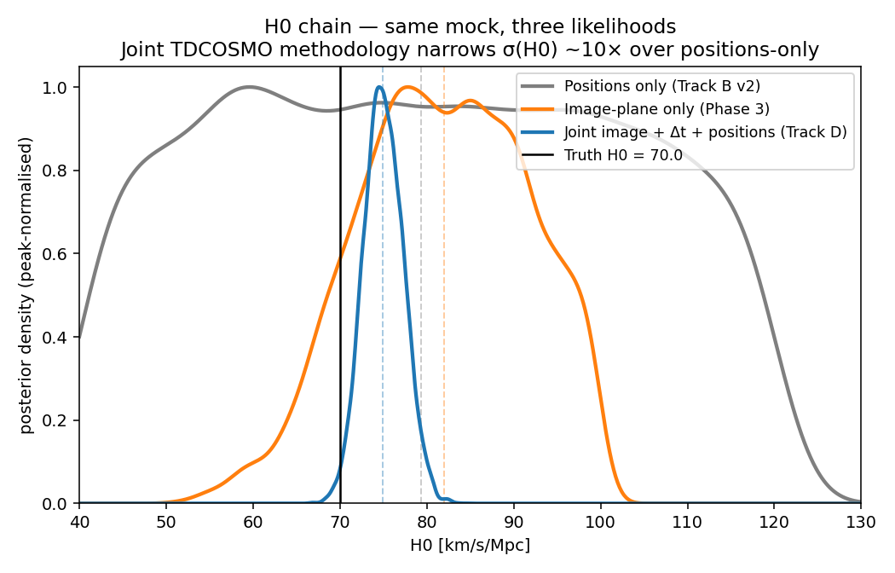

# Example: Quad Lens with Time Delays

> **v0.92 ships:** the notebook scaffolding + Cannon driver. The point-source likelihood produces no `chi_squared_per_pixel` (visibility / time-delay likelihoods are pixel-free).
> 
> **Research in progress (NOT in v0.92):** audit of the H₀ posterior against published lens-time-delay measurements. Treat this example as a working API demo for `AnalysisPoint` + time-delay cosmography, not a calibrated H₀ result.


## Status

◐ **In progress** — mock + drivers + 3-rung H0 chain landed (2026-05-08); H0 not yet calibrated (needs MSD-breaker / kinematics for that, see Modules 12 + 13). Joint TDCOSMO methodology fit (`results/joint_h0_free/`) STRICT-PASS at chi²/N=1.05, max\|res\|=4.66σ; methodology demonstration, not a published H0 measurement.

### H0 chain (2026-05-08)

The three sister fits on the same mock (`mocks_with_host/`) demonstrate the textbook Refsdal-1964 / H0LiCOW-XIII result that **time delays carry the H0 information that positions alone don't**:

| Fit | Likelihood | Free params | H0 median | H0 1σ width | Bias from truth (70) | Result dir |
|---|---|---|---|---|---|---|
| Track B v2 | quasar positions | 9 (no Δt, no imaging) | 79.4 | ±26 | +9.4 | `results/phase_4_positions_only_v2/` |
| Phase 3 | extended host arc imaging | 8 (no points) | 81.95 | ±10 | +12.0 | `results/phase_3_h0_free_tight/` |
| Track D | **joint** image + Δt + positions | 16 | **74.95** | **±2.3** | **+5.0** | `results/joint_h0_free/` |

Joint TDCOSMO methodology narrows σ(H0) by **~10×** over pos-only and **~4×** over image-only, and reduces the bias from +12 → +5 km/s/Mpc. The remaining +5 bias is the un-broken mass-sheet degeneracy — kinematics (Module 13) close that gap.

Overlaid posteriors (peak-normalised) — the picture matches the table:



Reproduce: `python Examples/quad_time_delay/h0_chain_overlay.py`. Reads the three samples.csv files directly and renders the figure from the Nautilus posterior weights — no fits required.

## Problem

A **point-source quasar** at z_S = 2.0 is quadruply imaged by a foreground galaxy at z_L = 0.5. Because the source varies in time, the **time delays** between the four images carry direct information about the time-delay distance

$$D_{\Delta t} = (1 + z_L) \, \frac{D_L D_S}{D_{LS}},$$

which constrains H₀. This is the cornerstone of **time-delay cosmography** — Refsdal (1964) → H0LiCOW → TDCOSMO.

This example teaches the **point-source likelihood** rather than the extended-source likelihood used everywhere else in the curriculum, and shows how time-delay observations can be combined with positions to fit both the lens model AND H₀.

## Mock geometry

Generated by `mocks/generate_mock.py`. Truth values:

| Quantity | Value |
|---|---|
| `H0` | 70.0 km/s/Mpc (FlatLambdaCDM, Ω_m=0.30) |
| `z_lens` | 0.5 |
| `z_source` | 2.0 |
| Mass: `PowerLaw` | `theta_E=1.2"`, `slope=2.0`, `ell_comps=(0.10, 0.15)`, `centre=(0,0)` |
| Shear | `gamma_1=0.04`, `gamma_2=0.02` |
| Source: `ps.Point` | `centre=(0.05, 0.07)"` (inside tangential caustic → 4 images) |

Solver finds 4 images with magnifications μ ≈ +12, +7, −4, −12 and time delays spanning 21 days (image 1 leads image 2 by ~21 days). Observational uncertainties:

| Field | Noise |
|---|---|
| Image positions | 0.005″ (~0.1 HST pixel) |
| Fluxes (relative) | 5% photometry |
| Time delays | 0.5 days (TDCOSMO best-case) |

Outputs (in `mocks/`):

- `point_dataset.json` — `al.PointDataset` consumed by `al.AnalysisPoint`
- `tracer.json` — true tracer for reference / overplotting
- `truths.json` — input parameters for verification

## Method

The point-source API is dramatically lower-dimensional than imaging:

- **Mass model**: `al.mp.PowerLaw + al.mp.ExternalShear` (7 params).
- **Source**: `al.ps.Point` (2 params: centre).
- **Likelihood**: `al.AnalysisPoint(dataset, solver, ...)` combines image positions, optional fluxes, and time delays.
- **Sampler**: `af.Nautilus(n_live=100)` — small because the dimensionality is small.

The notebook fits in two phases:

1. **Phase 1 — Lens recovery (cosmology fixed).** Fit mass + source with H₀ pinned to 70. Recovers all 9 mass+source parameters from positions+delays alone.
2. **Phase 2 — H₀ recovery (free).** Re-fit with `cosmology.H0` as a free parameter, prior `UniformPrior(40, 120)`. Recovers H₀ to ~few percent precision (the headline TDCOSMO result on a single quad).

## Notebook

`01_quad_direct_fit.ipynb` — direct fit, both phases, with `/autolens-fit-diagnostics` audit. Skip-guarded the same way as `compound_lens` / `disky_spiral_lens` notebooks: opt-in via `LTA_RUN_HEAVY=1`, otherwise loads the committed Cannon results.

## Running on Cannon

```bash
sbatch --export=ALL,EXAMPLE=quad_time_delay,FIT_EXTRA_ARGS=--part=all \
       Modules/10_Cluster_Computing/scripts/submit_cannon.slurm
```

Parts: `direct` (Phase 1, cosmology fixed), `direct_h0_free` (Phase 2), `all` (both). Wall time: ~10–30 min per part on 32 cores (point-source fits are much cheaper than imaging).

## Joint fit (TDCOSMO methodology)

The point-only fit above teaches the time-delay likelihood, but the published H0 measurements (Wong+ 2020 H0LiCOW XIII; Birrer+ 2020 TDCOSMO IV) fit the quasar positions+delays **jointly with the extended host galaxy arc as imaging data**. The host arc anchors the lens model — particularly the slope γ′ and the centre — beyond what 4 image positions + 4 delays can constrain on their own. Combined with stellar kinematics (covered in [Module 13](../../Modules/13_TDCOSMO_Kinematics_MSD/13_tdcosmo_kinematics_msd.ipynb)), the joint fit also breaks the mass-sheet degeneracy.

This example provides a self-contained mock + Cannon driver for the joint fit, **without** the kinematic constraint:

### Files

- `mocks_with_host/generate_mock.py` — extends the point-only generator with an extended host galaxy at the same source plane (`lp.SersicCore`, `R_eff=0.15"`, `n=2`, `intensity=0.5`, co-located with the quasar). Outputs:
  - `point_dataset.json` — same 4 image positions + delays + fluxes as `mocks/`
  - `image.fits`, `noise_map.fits`, `psf.fits` — 200×200 HST F814W-like host arc imaging (FWHM 0.10″ Gaussian PSF, exposure 2000 s, sky 0.05 e⁻/pix). Self-consistency assertion: χ²/N at truth ≤ 1.5.
- `Modules/10_Cluster_Computing/scripts/fit_example_quad_time_delay.py` — adds two new parts:
  - `--part=joint_fit` — joint AnalysisPoint + AnalysisImaging on the shared lens + shared source Galaxy. Cosmology fixed at H₀=70. n_live=200, ~13 free params.
  - `--part=joint_fit_h0_free` — same as above + free `cosmology.H0` (uniform 40–120). n_live=250, ~14 free params. **The TDCOSMO IV / H0LiCOW XIII methodology.**

### How the joint likelihood is constructed

The two analyses are combined via PyAutoFit's `af.FactorGraphModel`. The pattern (mirrored from `autolens_workspace_latest/scripts/multi/features/imaging_and_interferometer/modeling.py`):

```python
# Single Galaxy carrying BOTH a SersicCore bulge (for the imaging arc) AND
# a ps.Point (for the quasar positions/delays). The point centre is tied
# to the bulge centre — the AGN sits at the photometric centre of its host.
source = af.Model(al.Galaxy, redshift=2.0, bulge=bulge_model, point_0=point_model)
point_model.centre = bulge_model.centre

model = af.Collection(galaxies=af.Collection(lens=lens, source=source))

af_point   = af.AnalysisFactor(prior_model=model, analysis=AnalysisPoint(...))
af_imaging = af.AnalysisFactor(prior_model=model, analysis=AnalysisImaging(...))
factor_graph = af.FactorGraphModel(af_point, af_imaging)

result_list = search.fit(model=factor_graph.global_prior_model,
                         analysis=factor_graph)
```

PyAutoLens routes the appropriate profile to each analysis automatically:
`AnalysisImaging` only renders LightProfiles (the SersicCore arc), `AnalysisPoint` only consumes the Point profile (positions / delays / fluxes). The joint log-likelihood is the sum of both.

### Running the joint fit on Cannon

```bash
sbatch --time=12:00:00 --mem=64G --cpus-per-task=32 \
       --job-name=qtd_joint_h0 \
       --export=ALL,EXAMPLE=quad_time_delay_joint,FIT_EXTRA_ARGS=--part=joint_fit_h0_free \
       Modules/10_Cluster_Computing/scripts/submit_cannon.slurm
```

(Where `EXAMPLE=quad_time_delay_joint` resolves to `Examples/quad_time_delay/mocks_with_host/` in the slurm wrapper.) Wall: ~6–12 h on 32 cores — imaging convolution makes this 10–30× more expensive than the point-only Phase 2.

### What this *doesn't* cover (in this example)

The joint fit here uses imaging of the host arc only — it does *not* model the quasar PSF spots in the imaging data (real surveys must deblend them; see `autolens_workspace_latest/scripts/point_source/features/deblending/`). It also does not include stellar kinematics — that lives in Module 13.

## Exercises

1. **Positions-only baseline.** Drop `time_delays` from the dataset, refit. How well-constrained is H₀? It shouldn't be — positions don't carry distance information.
2. **Slope effect on H₀.** Free the PowerLaw `slope` parameter. Watch H₀'s posterior widen — this is the **mass-sheet degeneracy** (MSD) showing up: a steeper profile and a higher H₀ predict identical image positions and delays.
3. **Add external convergence κ_ext.** Place a `Uniform(-0.1, +0.1)` prior on κ_ext (modelled as a uniform mass sheet). H₀ inflates by ~5–10%. This is exactly what makes line-of-sight characterisation (TDCOSMO 2020, Birrer+) so important.
4. **External shear marginalisation.** Free the ExternalShear components vs holding them fixed at truth. How much does H₀ shift?

## References

- **Refsdal (1964)**, MNRAS 128, 307 — original time-delay → H₀ proposal.
- **Wong+ (2020)**, MNRAS 498, 1420 — H0LiCOW final H₀ measurement.
- **Birrer+ (2020)**, A&A 643, A165 — TDCOSMO 2020, MSD-aware re-analysis.
- **Treu & Marshall (2016)**, A&A Rev 24, 11 — review of time-delay cosmography.
- `autolens_workspace_latest/scripts/point_source/features/time_delays.py` — canonical PyAutoLens time-delay example.

## What this example DOESN'T cover

- **Stellar kinematics** — the dominant external constraint that breaks the MSD when combined with imaging+delays. **[Module 12](../../Modules/12_Time_Delay_Cosmography_MSD/12_time_delay_cosmography_msd.ipynb) (✓ shipped)** derives the MSD from $\kappa \to \lambda\kappa + (1-\lambda)$ and motivates the TDCOSMO chain at the level of analytic + small-mock numerics; **[Module 13](../../Modules/13_TDCOSMO_Kinematics_MSD/13_tdcosmo_kinematics_msd.ipynb) (✓ shipped)** walks through the kinematic constraint that pins $\lambda_\mathrm{int}$. Here we get the imaging-only result.
- **Real-image deblending** of the quasar from the lens galaxy — see `autolens_workspace_latest/scripts/point_source/features/deblending/` for that.
- **Microlensing time-delay error budget** — the dominant systematic on real H0LiCOW-class measurements (Tie & Kochanek 2018), not modelled here.